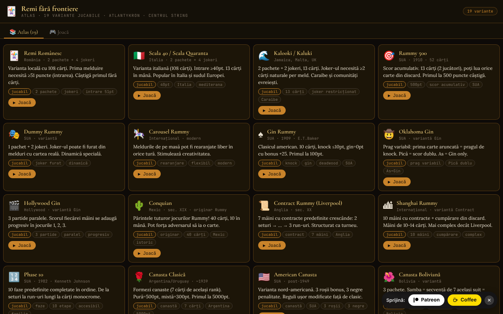

# Remi fără frontiere

Atlas de rummy cu 19 variante jucabile contra AI, într-un singur fișier HTML.

**Live:** https://chiuta.github.io/Remi-fara-frontiere/

## Ce este

Remi fără frontiere (subtitlu în aplicație: „Atlas · 19 variante jucabile · Atlantykron · Centrul StrING") este un atlas al jocurilor din familia rummy, în care fiecare variantă poate fi jucată împotriva unui adversar AI. Interfața este în română, cu piese și cărți mari.

## Funcții

- Fila **Atlas (19)**: fișe pentru fiecare variantă, cu origine, descriere, etichete și butonul „▶ Joacă".
- Fila **Joacă**: selector de variantă, grupat pe tipuri: *Cu masă comună*, *Knock / Gin*, *Contract*, *Faze*, *Canasta*, *Plăcuțe*.
- Cele 19 variante: Remi Românesc, Scala 40, Kalooki, Rummy 500, Dummy Rummy, Carousel Rummy, Gin Rummy, Oklahoma Gin, Hollywood Gin, Conquian, Contract Rummy, Shanghai Rummy, Phase 10, Canasta Clasică, American Canasta, Canasta Boliviană, Okey, Rummikub, Mahjong (simplificat).
- Tablă de joc cu stoc, grămadă de aruncate, melduri pe masă, mâna jucătorului, scoruri (Tu / AI), mesaje de stare și text de ajutor cu regulile variantei curente.
- Elemente specifice: contractul curent (Contract/Shanghai), fazele (Phase 10), indicatorul Okey, praguri de knock / gin.
- Joc contra AI; ecran de final cu „▶ Joacă din nou" și „✕ Închide".
- Elementele interactive principale (stoc, aruncate) sunt accesibile și de la tastatură (Enter / Spațiu).

## Manual de utilizare

1. Deschideți pagina; în fila „📚 Atlas (19)" citiți fișele variantelor.
2. Apăsați „▶ Joacă" pe o fișă, sau treceți în fila „🎮 Joacă" și alegeți varianta din „Alege o variantă de jucat contra AI".
3. În tura dumneavoastră (starea afișată: „Trage"): trageți o carte din stoc sau din grămada de aruncate.
4. Apoi (starea „Acțiune"): folosiți butoanele de acțiune afișate sub tablă (de ex. coborârea de melduri, knock sau aruncarea unei cărți, în funcție de variantă) și citiți îndrumarea din zona de ajutor.
5. Urmăriți scorul în panourile „Tu" și „AI"; la final alegeți „▶ Joacă din nou" sau „✕ Închide".
6. „← Selectare" vă readuce la alegerea variantei.

## Confidențialitate și rețea

- Aplicația nu folosește `localStorage`, IndexedDB sau cookie-uri și nu face apeluri de rețea (CSP cu `connect-src 'self'`); fonturile sunt încorporate în fișier.
- Linkurile „Patreon" și „Coffee" se deschid doar la clic.
- Fără analitice.

## Rulare locală / offline

Descărcați `index.html` și deschideți-l în browser; funcționează complet fără internet.

## Licență

CC0 1.0 Universal (domeniu public) — vezi fișierul LICENSE

## Autor

Alexio — Alexandru-Ionuț Chiuță. Contact: alexio@trom.tf. Aplicația menționează Atlantykron și Centrul StrING în subtitlu.

## English summary

A single-file Romanian-language atlas of 19 rummy-family games (Romanian Rummy, Gin Rummy, Canasta, Okey, Rummikub, Phase 10, Mahjong simplified and more), each playable against an AI opponent. No storage and no network requests. CC0 1.0.
